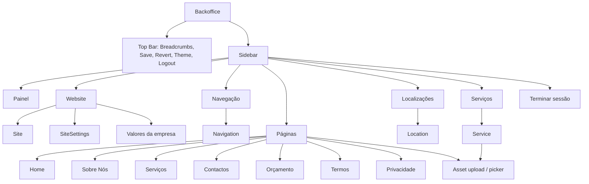

# Backoffice Navigation

Target navigation model for the normalized MongoDB architecture described in
`docs/mongoose-models.md`.

The backoffice should be organized around editor-friendly top-level entities,
not around internal implementation details. Assets are stored as documents, but
they are not a direct navigation item. Values are content, but they are edited
inside website/page areas, not as a direct navigation item. Leads are out of
scope for now.

## Ordering Principle

Navigation is sorted from **most unique / global** to **least unique /
repeatable**:

1. Dashboard / overview
2. Website-wide settings
3. Navigation
4. Fixed pages
5. Locations
6. Services

## Top Bar

The top bar is global and appears on all authenticated backoffice routes.

```text
Breadcrumbs                         Save status   Reverter   Gravar   Theme   Logout
Backoffice > Serviços               Tudo gravado  [disabled] [disabled] [icon] [Sair]
```

Top bar responsibilities:

- Breadcrumbs for current section.
- Save state: `Tudo gravado` / `Alterações por gravar`.
- `Reverter` unsaved local edits.
- `Gravar` persisted changes.
- Theme toggle.
- Logout.

Logout should be visible in the top bar or sidebar footer. If it appears in the
sidebar footer, the top bar does not need a second logout button.

## Sidebar Navigation

```text
Backoffice
├─ Painel
├─ Website
├─ Navegação
├─ Páginas
├─ Localizações
└─ Serviços

Footer
└─ Terminar sessão
```

## Route Map

| Label | Route | Entity / Responsibility | Repeatable? |
| --- | --- | --- | --- |
| Painel | `/backoffice` | Overview, latest save/source, entity counts, quick links | No |
| Website | `/backoffice/website` | `Site` + `SiteSettings`: brand, company info, contact, schedule, social, default SEO | No |
| Navegação | `/backoffice/navigation` | `Navigation`: header links, footer links | Links are repeatable inside singleton |
| Páginas | `/backoffice/pages` | `Page`: fixed page documents (`home`, `about`, `services`, `contact`, `quote`, `terms`, `privacy`) | Fixed set |
| Localizações | `/backoffice/locations` | `Location`: addresses, map URLs, primary location | Yes |
| Serviços | `/backoffice/services` | `Service`: service cards/details, icon, tier, image, bullets, order | Yes |

## Entity Placement

### Website

`Website` contains the most global content:

- `Site`
  - key
  - name
  - domain
  - status
- `SiteSettings`
  - brand name
  - tagline
  - description
  - phone
  - email
  - WhatsApp
  - app URL
  - schedule
  - social links
  - default SEO

Company `Value` documents should be edited here or within the `Páginas > Sobre
Nós` editing experience, but there should not be a direct `Valores` sidebar item.
If edited here, label the sub-section as `Valores da empresa`.

### Navegação

`Navegação` edits the singleton `Navigation` document:

- Header links
- CTA link flag
- Footer company links
- Link ordering

### Páginas

`Páginas` edits fixed `Page` documents. This can be represented as nested tabs or
a secondary list inside the page section:

```text
Páginas
├─ Home
├─ Sobre Nós
├─ Serviços
├─ Contactos
├─ Orçamento
├─ Termos
└─ Privacidade
```

Each page screen edits:

- SEO
- Hero
- Page-specific sections

The page editor should not expose raw JSON. It should use structured fields.

### Localizações

`Localizações` edits repeatable `Location` documents:

- city
- address lines
- map search URL
- map embed URL
- primary flag
- order

The primary location is the single source for the main address used on:

- homepage
- footer
- contact page

Only one location can be primary.

### Serviços

`Serviços` edits repeatable `Service` documents:

- slug
- title
- icon
- tier
- short text
- description
- bullets
- image asset
- order

Assets are selected/uploaded contextually from this form. Do not add an `Assets`
sidebar item.

## Hidden / Contextual Entities

These are real entities but should not appear as top-level navigation items.

### Asset

`Asset` is a technical support entity for uploaded files.

Users interact with assets through:

- image upload controls
- image picker modals
- remove/replace image actions

No direct sidebar item.

### Value

`Value` is content, but it is conceptually part of company/about content.

Preferred placement:

- `Website > Valores da empresa`, or
- `Páginas > Sobre Nós > Valores`

No direct sidebar item.

### Lead

`Lead` is planned for later. Do not include it yet.

Future placement:

```text
Backoffice
└─ Leads
```

Only add this when the form submission/inbox workflow exists.

## Diagram



## Save Behavior

Each section saves the relevant normalized entity/entities:

- `Website` saves `Site`, `SiteSettings`, and optionally company values.
- `Navegação` saves `Navigation`.
- `Páginas` saves one or more `Page` documents.
- `Localizações` saves `Location` documents.
- `Serviços` saves `Service` documents and may upload/upsert `Asset` documents.

After a successful save, invalidate the public `website-content` cache tag.

## Current Migration Note

The current codebase still has a single `BackofficeEditor` component. The future
normalized version should split this into route-level editors:

```text
src/app/backoffice/(protected)/website/page.tsx
src/app/backoffice/(protected)/navigation/page.tsx
src/app/backoffice/(protected)/pages/page.tsx
src/app/backoffice/(protected)/locations/page.tsx
src/app/backoffice/(protected)/services/page.tsx
```

Each route should load/edit only the entity group it owns. The global top bar can
continue to host the save/revert controls.
